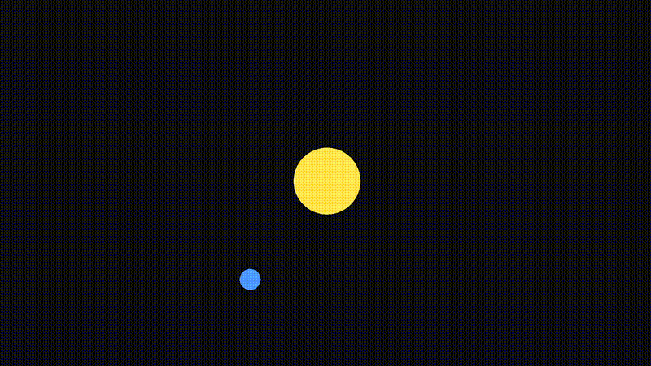

# Hyperstellar
### Write math equations in Python. Run them on the GPU.

Buckle up, because this isn't just another preset physics engine. Hyperstellar gives you the mathematical language to define *any* dynamical system, then GPU-accelerates it to thousands of frames per second. From orbital mechanics to fluid dynamics — if you can write the equation, you can simulate it.

<p align="center">
  
</p>

## Why Hyperstellar?

Most Python simulation tools make you choose between ease and performance. CPU-based libraries (NumPy, SciPy) are easy but slow. GPU tools (CUDA, Taichi, Warp) are fast but require learning new languages or shader programming. Hyperstellar gives you both: write plain Python, get GPU performance.

| | Hyperstellar | NumPy (CPU) | Taichi | NVIDIA Warp |
|---|---|---|---|---|
| Write in Python | ✓ | ✓ | ✗ (own lang) | ✓ (decorators) |
| No shader code | ✓ | ✓ | ✓ | ✓ |
| Real-time visualization | ✓ built-in | ✗ | partial | ✗ |
| Per-pixel paint shader | ✓ | ✗ | ✓ | ✗ |
| Visual editor app | ✓ (beta) | ✗ | ✗ | ✗ |
| Collision system | ✓ | ✗ | ✗ | partial |
| pip install | ✓ | ✓ | ✓ | ✓ |

## Performance

Tested on integrated graphics (iGPU — no dedicated GPU):

| Objects | FPS |
|---|---|
| 1,000 | ~60 fps |
| 5,000 | ~52 fps |

Each object runs a per-frame force equation live on the GPU. This is not pre-baked animation — it's real-time physics computation.

## Installation

```bash
pip install hyperstellar
```

Supports **Windows 10/11** and **Linux** (x86-64), Python 3.13.

---

## Quick Start

### Planetary orbit

```python
import hyperstellar as se
import math

sim = se.Simulation(headless=False, enable_grid=False)
while not sim.are_all_shaders_ready():
    sim.update_shader_loading()  # one-time GPU initialization
while sim.object_count() > 0:
    sim.remove_object(0)

G, M_star, M_planet, sep = 1.0, 50.0, 1.0, 3.0
v_orbit = math.sqrt(G * (M_star + M_planet) / sep)

star = sim.add_object(x=0, y=0, vy=M_planet*v_orbit/(M_star+M_planet),
                      mass=M_star, skin=se.SkinType.CIRCLE, size=0.8)
planet = sim.add_object(x=sep, y=0, vy=-M_star*v_orbit/(M_star+M_planet),
                        mass=M_planet, skin=se.SkinType.CIRCLE, size=0.25)

sim.set_equation(star,
    f"{G}*{M_planet}*(p[1].x-x)/((p[1].x-x)^2+(p[1].y-y)^2)^1.5,"
    f"{G}*{M_planet}*(p[1].y-y)/((p[1].x-x)^2+(p[1].y-y)^2)^1.5,"
    "0, 1.0, 0.9, 0.3, 1.0"
)
sim.set_equation(planet,
    f"{G}*{M_star}*(p[0].x-x)/((p[0].x-x)^2+(p[0].y-y)^2)^1.5,"
    f"{G}*{M_star}*(p[0].y-y)/((p[0].x-x)^2+(p[0].y-y)^2)^1.5,"
    "0, 0.3, 0.6, 1.0, 1.0"
)

while not sim.should_close():
    sim.update(0.016)
    sim.render()
    sim.process_input()
```

### Bouncing ball

```python
import hyperstellar as se

sim = se.Simulation(headless=False, enable_grid=False, width=1400, height=1000)
while not sim.are_all_shaders_ready():
    sim.update_shader_loading()
while sim.object_count() > 0:
    sim.remove_object(0)

ball = sim.add_object(x=0, y=20, mass=0.1, skin=se.SkinType.CIRCLE, size=0.8)
platform = sim.add_object(x=0, y=-1, mass=1e12, skin=se.SkinType.RECTANGLE,
                          height=3.0, width=10.0)

sim.set_collision_properties(ball, restitution=0.8, friction=0.5)
sim.set_collision_properties(platform, restitution=0.7, friction=0.5)
sim.set_collision_shape(ball, se.CollisionShape.CIRCLE)
sim.set_collision_shape(platform, se.CollisionShape.AABB)

sim.set_equation(ball, "0, -9.8, 0, 1.0, 0.3, 0.3, 1.0")
sim.set_equation(platform, "0, 0, 0, 0.3, 1.0, 1.0, 1.0")

while not sim.should_close():
    sim.update(0.067)
    sim.render()
    sim.process_input()
```

### 50,000 particle ring (GPU benchmark)

```python
import hyperstellar as se
import math

N, dt = 50000, 0.0006
sim = se.Simulation(headless=False)
while not sim.are_all_shaders_ready():
    sim.update_shader_loading()
while sim.object_count() > 0:
    sim.remove_object(0)

R = (N * 0.4) / (2 * math.pi)
K, V = 1.5, math.sqrt(1.5 * R)

for i in range(N):
    angle = (i / N) * 2 * math.pi
    x, y = math.cos(angle) * R + R, math.sin(angle) * R
    vx, vy = -math.sin(angle) * V, math.cos(angle) * V
    obj = sim.add_object(x=x, y=y, vx=vx, vy=vy, size=0.15)
    sim.set_collision_enabled(obj, False)
    sim.set_equation(obj, f"-(x-{R})*{K/R}, -y*{K/R}, 0, 0.5, 0.2, 1.0, 1.0")

while not sim.should_close():
    sim.update(dt)
    sim.render()
    sim.process_input()
```

---

## Core Concepts

### Equation Format

Every object's behavior is defined by a comma-separated equation string:

```
"ax, ay, angular, r, g, b, a"
```

Only `ax` and `ay` are required. All other components default to `0` (angular) or `1.0` (color).

---

### New DSL Syntax — `let` and assignment

Use `let` to define intermediate values and `=` to assign outputs. Statements are separated by `;` or newlines:

```python
G = 1.0
sim.set_equation(body0,
    f"let dx = p[1].x - x; "
    f"let dy = p[1].y - y; "
    f"let r = sqrt(dx*dx + dy*dy + 0.01); "
    f"ax = {G}*p[1].mass*dx/(r*r*r); "
    f"ay = {G}*p[1].mass*dy/(r*r*r); "
    f"color.r = 1.0; color.g = 0.4; color.b = 0.2"
)
```

Assignable targets:

| Target | Meaning |
|---|---|
| `ax` | X acceleration |
| `ay` | Y acceleration |
| `angular` | Angular acceleration |
| `color.r`, `color.g`, `color.b`, `color.a` | Object color |
| `size` | Object size |
| `data.x`, `data.y` | Rotation / angular velocity |

The two styles cannot be mixed in a single equation — choose one per equation. Both are fully supported across the simulation.

---

### Available Variables

| Variable | Meaning |
|---|---|
| `x`, `y` | Position |
| `vx`, `vy` | Velocity |
| `ax`, `ay` | Previous acceleration |
| `theta` | Rotation angle |
| `omega` | Angular velocity |
| `mass` | Object mass |
| `charge` | Object charge |
| `r`, `g`, `b`, `a` | Current color (RGBA) |
| `t` | Simulation time |
| `i` | Imaginary unit |
| `pi`, `e` | Mathematical constants |
| `k`, `damping`, `gravity`, `coupling`, `freq`, `amp` | Global simulation parameters |

---

### Object References

Reference any other object using `p[index].property`:

```python
# Pull toward object 0
sim.set_equation(obj,
    "let dx = p[0].x - x; "
    "let dy = p[0].y - y; "
    "let r = sqrt(dx*dx + dy*dy + 0.01); "
    "ax = dx/(r*r*r); "
    "ay = dy/(r*r*r)"
)
```

| Property | Meaning |
|---|---|
| `p[i].x`, `p[i].y` | Position |
| `p[i].vx`, `p[i].vy` | Velocity |
| `p[i].ax`, `p[i].ay` | Acceleration |
| `p[i].mass` | Mass |
| `p[i].charge` | Charge |
| `p[i].color.r/g/b/a` | Color state |

---

### Built-in Functions

**Math:** `sin`, `cos`, `tan`, `sqrt`, `log`, `exp`, `abs`, `floor`, `ceil`, `frac`, `sign`, `step`

**Two-argument:** `min(a,b)`, `max(a,b)`, `mod(a,b)`, `atan2(y,x)`

**Three-argument:** `clamp(x, min, max)`

**Complex numbers:** use `i` as the imaginary unit directly in expressions:

`real(z)`, `imag(z)`, `conj(z)`, `arg(z)`

```python
# Complex spiral attractor (old style)
sim.set_equation(obj, "real(conj(x + y*i) * (vx + vy*i)), imag(conj(x + y*i) * (vx + vy*i))")
```

**Vectors and tensors:** use `[a, b]` or `[a, b, c]` literals:

| Function | Description |
|---|---|
| `dot(v1, v2)` | Dot product of two vectors |
| `cross(v1, v2)` | Cross product |
| `norm(v)` / `length(v)` | Vector magnitude |
| `comp(tensor, i)` | Extract component `i` from a vector/tensor |

**Operators:** `+`, `-`, `*`, `/`, `^` (power, right-associative)

**Advanced:**

| Function | Description |
|---|---|
| `select(cond, a, b)` | Returns `a` if `cond > 0`, else `b`. Supports `<`, `<=`, `>`, `>=`, `==`, `!=` |
| `sum_neighbors(weight, body)` | Sums `weight * body` over all other objects. Use `i` inside to reference the neighbor index |
| `noise(x, y)` | Smooth Perlin noise |
| `rand()` | Random value per frame per object |
| `D(expr, var, order)` | Numerical derivative of `expr` w.r.t. `var` (order 1–4, valid vars: `x`, `y`, `theta`) |

```python
# Attraction only to nearby objects (new style)
sim.set_equation(obj,
    "let dx = p[0].x - x; "
    "let dy = p[0].y - y; "
    "let r = sqrt(dx*dx + dy*dy); "
    "ax = select(r < 5.0, dx/r, 0); "
    "ay = select(r < 5.0, dy/r, 0)"
)

# Sum gravitational pull from all neighbors (old style)
sim.set_equation(obj,
    "sum_neighbors(p[i].mass, (p[i].x-x)/((p[i].x-x)^2+(p[i].y-y)^2)^1.5),"
    "sum_neighbors(p[i].mass, (p[i].y-y)/((p[i].x-x)^2+(p[i].y-y)^2)^1.5)"
)

# Numerical derivative (old style)
sim.set_equation(obj, "D(x^2, x, 1), 0")
```

---

### Color as Simulation State

Color channels are live simulation state — updated every frame on the GPU. Use them to visualize any physical quantity:

```python
# Shift from blue to red based on speed (new style)
sim.set_equation(obj,
    "let spd = sqrt(vx^2 + vy^2); "
    "ax = 0; ay = -3; "
    "color.r = spd/10; color.g = 0.3; color.b = 1.0-spd/10"
)
```

---

### Paint — Per-pixel Field Visualization

`sim.paint()` runs a GPU shader over every pixel of the background. Use it to visualize fields, potentials, or any function of world-space position `px`, `py`.

```python
# Gravitational potential field from two bodies
sim.paint("""
    let dx0 = p[0].x - px;
    let dy0 = p[0].y - py;
    let dx1 = p[1].x - px;
    let dy1 = p[1].y - py;
    let d0 = sqrt(dx0*dx0 + dy0*dy0 + 0.01);
    let d1 = sqrt(dx1*dx1 + dy1*dy1 + 0.01);
    let field = p[0].mass/d0 + p[1].mass/d1;
    color.r = field * 0.6;
    color.g = field * 0.2;
    color.b = field * 1.0;
""")
```

Paint uses the same DSL syntax as object equations — `let` bindings, all built-in functions, object references. The only restriction is valid assignment targets are limited to `color.r`, `color.g`, `color.b`.

**Paint variables:**

| Variable | Meaning |
|---|---|
| `px`, `py` | World-space position of the current pixel |
| `p[i].x`, `p[i].y`, `p[i].mass`, ... | Any object property |
| `color.r`, `color.g`, `color.b` | Output pixel color — only valid assignment targets in paint |

**Performance:** lower the paint resolution for faster rendering:

```python
sim.set_paint_resolution(40, 80)  # width x height in texels
```

---

### Headless Mode

Run without a window for data collection or batch processing:

```python
sim = se.Simulation(headless=True)
while True:
    sim.update(dt)
    state = sim.get_object(obj)
    print(state.x, state.y)
```

---

### Collision System

```python
sim.set_collision_parameters(enabled=True, iterations=20)
sim.set_collision_shape(obj, se.CollisionShape.CIRCLE)  # or AABB, POLYGON
sim.set_collision_properties(obj, restitution=0.9, friction=0.5)
sim.set_collision_enabled(obj, True)
```

---

### Constraints

```python
sim.add_boundary_constraint(obj, se.BoundaryConstraint(min_x, max_x, min_y, max_y))
sim.add_distance_constraint(obj, se.DistanceConstraint(target_obj, rest_length))
```

---

### Shapes

| Skin | Collision |
|---|---|
| `se.SkinType.CIRCLE` | `se.CollisionShape.CIRCLE` |
| `se.SkinType.RECTANGLE` | `se.CollisionShape.AABB` |
| `se.SkinType.POLYGON` | `se.CollisionShape.POLYGON` |

---

## The App

Hyperstellar ships with a **visual editor** built in ImGui. Build and configure simulations visually, save your project, and load it back — similar to how Unity and Visual Studio relate to each other. The Python API and the app share the same project format.

---

## Examples

| Example | Description |
|---|---|
| `examples/orbit.py` | Two-body Newtonian gravity |
| `examples/three_body.py` | Figure-8 three-body solution with gravitational field paint |
| `examples/pendulum.py` | Spring-based harmonic motion |
| `examples/boids.py` | Emergent flocking with obstacle avoidance |
| `examples/mcmc.py` | Metropolis-Hastings sampling on GPU |
| `examples/ballpit.py` | 500–10,000 colliding balls |

---

## Roadmap

- [x] Linux official release
- [ ] More collision shapes (OBB, convex polygon)
- [ ] Full constraints system
- [ ] API reference documentation
- [ ] More examples

---

## Contributing

Contributions welcome — code, documentation, examples, and bug reports all help. See `src/bindings.cpp` for the full API surface while formal docs are in progress.

## License

See [LICENSE](LICENSE).
